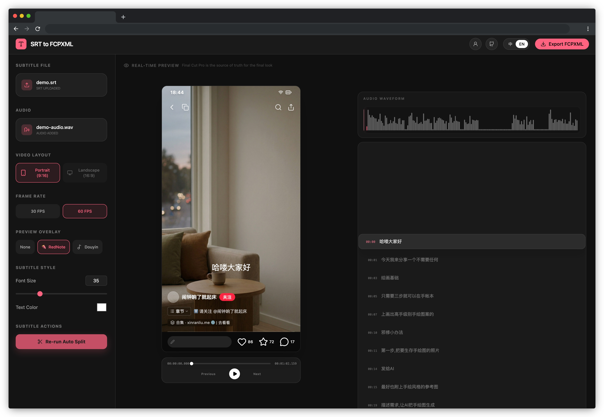

# SRT to FCPXML Converter

A browser-based subtitle tool for Final Cut Pro: convert `.srt` files into importable `.fcpxml`, with automatic line splitting, waveform-assisted preview, and in-browser editing.

一个面向 Final Cut Pro 的浏览器字幕工具：将 `.srt` 文件转换为可导入的 `.fcpxml`，并提供自动拆行、波形辅助预览和在线编辑能力。

## Highlights

- Import `.srt` subtitle files / 导入 `.srt` 字幕文件
- Export Final Cut Pro compatible `.fcpxml` / 导出兼容 Final Cut Pro 的 `.fcpxml`
- Automatically split long subtitle lines for portrait layouts / 针对竖屏布局自动拆分长字幕
- Keep subtitle positioning within the video safe area / 字幕位置已适配视频安全区域
- Preview subtitles with RedNote / Douyin overlays / 支持小红书和抖音浮层预览
- Review subtitles against a reference audio waveform and edit text in place / 结合参考音频波形检查字幕，并支持直接在线编辑字幕文本
- Adjust subtitle text color and font size / 支持调整字幕文字颜色和字号

## Coming soon

- Landscape layout support / 支持横屏布局
- Subtitle timing editing / 支持编辑字幕时间点

## Docs

- 中文: [README.zh-CN.md](./README.zh-CN.md)
- English: [README.en.md](./README.en.md)
